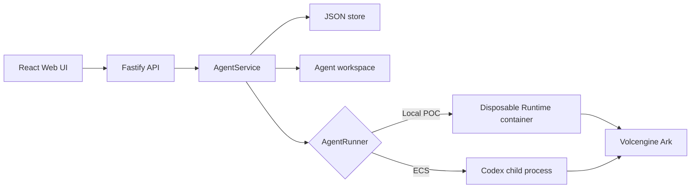
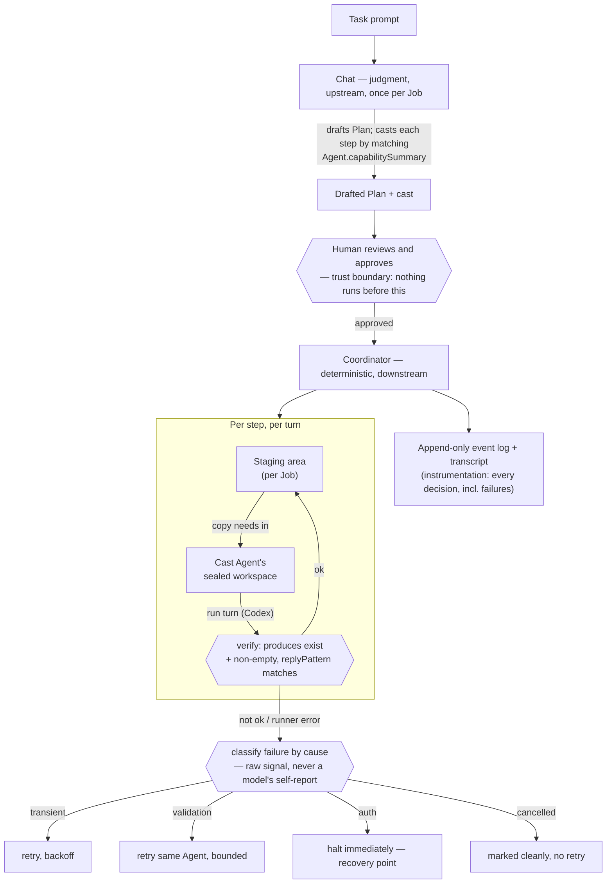

# Architecture

Volc Agent Launchpad is a single-node control plane for hackathon use.



## Agent kinds

Three kinds, which decide where an Agent appears and what it may do
(`apps/server/src/agent-kinds.ts`):

| Kind | Sidebar | Chattable | Plans and fans out | Cast by a Plan |
| --- | --- | --- | --- | --- |
| `chat` | "Chats" | Yes | Yes | No |
| `template` | "Your Agents" | Yes, one-to-one | No | Yes |
| `worker` | nested under its Chat | No | No | No |

Casting a `template` never runs it — it is cloned into a fresh `worker` for that
Job. So a template stays a reusable role definition, each Job gets isolated
Agents, and a worker remains a read-only record of what that Job did.

## Components

### Web UI

Lists Agents, manages lifecycle actions, submits prompts, and polls asynchronous
Runs. It never receives the Ark API key.

### Fastify API

Validates requests, protects remote demos with a shared bearer token, and
serves the compiled Web UI. The token is not user identity or authorization.

### AgentService

Coordinates lifecycle state, persistence, workspaces, and Runs. One Agent can
have only one active Run.

```text
ready -> busy -> ready
  |       |
  v       v
stopped  error
```

Interrupted Runs become `cancelled` after a restart.

### Storage

```text
data/launchpad.json       Agent, message, Run, Job, and coordination metadata
data/jobs/JobID/staging/  Per-Job staging area files move through
workspaces/AgentID/       Agent-created files
workspaces/.deleted/      Archived deleted workspaces
codex-home/               Codex configuration and sessions
```

`JsonStore` serializes writes and atomically replaces one JSON file. It supports
one process only.

### Runtime providers

- `CodexRunner` runs Codex inside the application container for ECS.
- `ContainerCodexRunner` starts one disposable Docker, Colima, or Podman
  container for every local turn.

Both providers use argv-only process execution, bound output and time, resume
the stored Codex thread, and escalate termination after a grace period.

## Deployment profiles

| Profile | Control plane | Agent execution |
| --- | --- | --- |
| Local POC | Host Node.js | Disposable local container |
| ECS | Application container | Codex process in the same container |
| Local development | Host Node.js | Host Codex process |

## Coordination middleware

Two components, split by when they run and what kind of decision they make.
Full rationale, the exact failure-handling table, and known limitations live
in [AGENTS.md §5](../AGENTS.md#5-architecture--orchestrator-and-coordinator) —
this section is the one-page picture of the same design.



- **Trust boundary:** the human-approval gate between drafting and execution —
  the Chat's one judgment call (matching, planning) is always reviewed
  before the Coordinator's deterministic execution ever starts.
- **Data flow:** real files, not descriptions of them, move step to step
  through the staging area; Agents never see each other's workspaces directly.
- **Recovery point:** the failure classifier. A transient blip gets a backoff
  retry, wrong output gets a bounded retry on the same Agent, and an
  auth/config problem halts immediately with a recorded reason instead of
  wasting retries it can't fix — the Job's `haltedReason` and the event log
  are the enforcement/instrumentation evidence for a demo.
- **Fan-out:** independent Steps run in parallel, and the drafting prompt now
  actively solicits that shape — one Step per independent part, each with its own
  role label, optionally followed by a single Step that `needs` all their outputs
  and synthesizes them. Sequencing comes only from real file dependencies.
- **Scope:** one Job runs at a time; every Agent a Plan casts is created through
  the draft-then-materialize flow; no mid-Job reassignment to a different Agent yet.

## Extension seams

| Track | Primary seam | Expected change |
| --- | --- | --- |
| Glass Box | `AgentRunner`, `AgentRun` | Emit and display correlated execution events. |
| Bouncer | API routes, Agent ownership | Add identity and server-side authorization. |
| Kill Switch | `AgentRunner` | Add threat-specific policy or a stronger sandbox. |

The current container or ECS instance is the POC trust boundary. Ordinary
containers are not hardened multi-tenant isolation.
